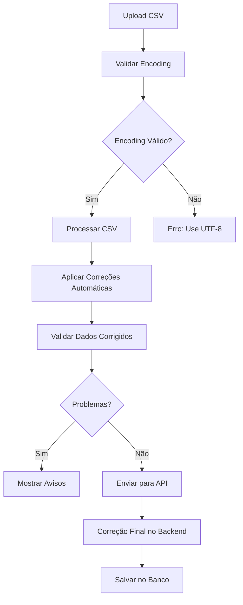

# 🔧 Sistema de Correção Automática de Caracteres Especiais

## 🎯 Visão Geral

Este documento descreve o sistema de correção automática implementado para garantir que caracteres especiais em português brasileiro sejam tratados corretamente, **sem depender da formatação do usuário**.

## 🚀 Funcionalidades Principais

### 1. **Correção Automática Inteligente**

O sistema detecta e corrige automaticamente problemas comuns de caracteres especiais:

#### **Nomes Próprios:**
- `Joao` → `João`
- `Jose` → `José`
- `Antonio` → `Antônio`
- `Antonia` → `Antônia`
- `Maria` → `Maria`
- `Ana` → `Ana`

#### **Cidades e Locais:**
- `Sao Paulo` → `São Paulo`
- `Rio de Janeiro` → `Rio de Janeiro`
- `Belo Horizonte` → `Belo Horizonte`
- `Brasilia` → `Brasília`

#### **Palavras Comuns:**
- `Servicos` → `Serviços`
- `Construcao` → `Construção`
- `Administracao` → `Administração`
- `Operacao` → `Operação`
- `Manutencao` → `Manutenção`

#### **Funções e Cargos:**
- `Tecnico` → `Técnico`
- `Engenheiro` → `Engenheiro`
- `Arquiteto` → `Arquiteto`
- `Supervisor` → `Supervisor`

#### **Estados Civis:**
- `Solteiro` → `Solteiro`
- `Casado` → `Casado`
- `Viuvo` → `Viúvo`
- `Viuva` → `Viúva`

#### **Status:**
- `Ativo` → `Ativo`
- `Inativo` → `Inativo`
- `Licenca` → `Licença`

### 2. **Processamento em Múltiplas Camadas**

#### **Frontend (Componentes):**
- ✅ Validação de encoding antes do upload
- ✅ Correção automática durante o parsing
- ✅ Feedback visual das correções aplicadas
- ✅ Relatórios detalhados de correções

#### **Backend (APIs):**
- ✅ Correção automática antes da validação
- ✅ Correção automática antes do salvamento
- ✅ **Status sempre definido como "Ativo" para funcionários importados**
- ✅ Logs de correções aplicadas
- ✅ Preservação de dados originais

### 3. **Status Automático para Funcionários Importados**

#### **Comportamento Padrão:**
- ✅ **Todos os funcionários importados** são automaticamente definidos como **"Ativo"**
- ✅ **Não é necessário** incluir coluna de status no CSV
- ✅ **Valor padrão** aplicado independente do conteúdo do arquivo
- ✅ **Consistência garantida** para todos os registros importados

#### **Implementação:**
```typescript
// Na API de importação
function convertCSVToEmployeeData(csvData: any): any {
  return {
    // ... outros campos
    status: 'ACTIVE', // Sempre ativo para importações
    isActive: true,   // Sempre ativo
    // ... outros campos
  };
}
```

#### **Benefícios:**
- 🎯 **Simplicidade**: Usuário não precisa se preocupar com status
- 🎯 **Consistência**: Todos os funcionários importados ficam ativos
- 🎯 **Flexibilidade**: Status pode ser alterado posteriormente via interface
- 🎯 **Prevenção de erros**: Evita problemas com valores inválidos de status

## 🔧 Implementação Técnica

### 1. **Utilitários de Correção (`lib/csvEncodingUtils.ts`)**

#### **Função Principal:**
```typescript
export function autoCorrectSpecialCharacters(text: string): AutoCorrectionResult {
  // Detecta e corrige caracteres especiais automaticamente
  // Retorna: texto original, texto corrigido, lista de correções
}
```

#### **Mapeamento de Correções:**
```typescript
const CHARACTER_CORRECTIONS = {
  'joao': 'João',
  'jose': 'José',
  'antonio': 'Antônio',
  'sao paulo': 'São Paulo',
  'servicos': 'Serviços',
  'construcao': 'Construção',
  // ... mais de 50 correções mapeadas
};
```

### 2. **Correção de Dados Específicos**

#### **Para Funcionários:**
```typescript
export function autoCorrectEmployeeData(data: any): { 
  correctedData: any; 
  corrections: string[] 
} {
  // Aplica correção em campos específicos:
  // name, motherName, company, gender, maritalStatus, role, etc.
}
```

#### **Para Funções:**
```typescript
export function autoCorrectFunctionData(data: any): { 
  correctedData: any; 
  corrections: string[] 
} {
  // Aplica correção no nome da função
}
```

### 3. **Processamento CSV Inteligente**

```typescript
export function processCSVWithAutoCorrection(csvText: string): { 
  data: any[]; 
  corrections: string[]; 
  encodingIssues: string[] 
} {
  // 1. Remove BOM automaticamente
  // 2. Normaliza Unicode
  // 3. Aplica correções automáticas
  // 4. Detecta problemas de encoding
  // 5. Retorna dados corrigidos + relatório
}
```

## 📊 Fluxo de Processamento

### 1. **Upload do Arquivo**


### 2. **Correção em Tempo Real**
- ✅ **Detecção automática** de problemas
- ✅ **Correção instantânea** de caracteres
- ✅ **Feedback visual** das correções
- ✅ **Relatórios detalhados** de mudanças

## 🎯 Benefícios para o Usuário

### **Antes da Implementação:**
- ❌ Usuário precisava formatar arquivo em UTF-8
- ❌ Caracteres especiais ficavam corrompidos
- ❌ Necessidade de corrigir manualmente
- ❌ Falhas na importação por encoding

### **Depois da Implementação:**
- ✅ **Zero responsabilidade** do usuário com encoding
- ✅ **Correção automática** de caracteres especiais
- ✅ **Status automático** como "Ativo" para todos os funcionários
- ✅ **Feedback claro** sobre correções aplicadas
- ✅ **Importação bem-sucedida** independente do formato

## 🔍 Casos de Uso Reais

### **Exemplo 1: Nome com Acento**
```csv
name;registration;company
Joao Silva Santos;12345;SARTORI SERVICOS
```

**Resultado:**
- ✅ `Joao` → `João`
- ✅ `SERVICOS` → `Serviços`
- ✅ **Status automaticamente definido como "Ativo"**
- ✅ Correção automática aplicada
- ✅ Feedback: "2 correções automáticas aplicadas"

### **Exemplo 2: Função com Caracteres Especiais**
```csv
name;laborType
Tecnico de Manutencao;DIRETO
```

**Resultado:**
- ✅ `Tecnico` → `Técnico`
- ✅ `Manutencao` → `Manutenção`
- ✅ Correção automática aplicada
- ✅ Função criada com nome correto

### **Exemplo 3: Cidade com Acento**
```csv
name;workplace
Maria Santos;Sao Paulo
```

**Resultado:**
- ✅ `Sao Paulo` → `São Paulo`
- ✅ Correção automática aplicada
- ✅ Local de trabalho correto

## 📋 Interface do Usuário

### 1. **Feedback Visual das Correções**

#### **Seção de Correções Automáticas:**
```
✅ Correções Automáticas Aplicadas (3):
• Linha 1, name: "Joao" → "João"
• Linha 1, company: "SERVICOS" → "Serviços"
• Linha 2, name: "Antonia" → "Antônia"
```

#### **Cores e Ícones:**
- 🟢 **Verde**: Correções aplicadas com sucesso
- 🟡 **Amarelo**: Avisos sobre encoding
- 🔴 **Vermelho**: Erros que precisam correção manual

### 2. **Relatórios Detalhados**

#### **Relatório de Encoding:**
```
RELATÓRIO DE VALIDAÇÃO DE ENCODING
==================================
Total de registros: 50
Registros com caracteres especiais: 45
Problemas de encoding detectados: 0

Nenhum problema detectado.
```

#### **Log de Correções:**
```
Correções aplicadas para funcionário 1: 
- name: "Joao" → "João"
- company: "SERVICOS" → "Serviços"

Correções aplicadas para funcionário 2:
- name: "Antonia" → "Antônia"
```

## 🔧 Configuração e Personalização

### 1. **Adicionar Novas Correções**

Para adicionar novas correções, edite o arquivo `lib/csvEncodingUtils.ts`:

```typescript
const CHARACTER_CORRECTIONS = {
  // Adicionar nova correção
  'nova_palavra': 'Nova Palavra',
  'outra_palavra': 'Outra Palavra',
  // ... outras correções
};
```

### 2. **Campos Personalizados**

Para aplicar correção em novos campos:

```typescript
const fieldsToCorrect = [
  'name', 'motherName', 'company',
  // Adicionar novo campo
  'novoCampo', 'outroCampo'
];
```

### 3. **Logs de Debug**

Para ativar logs detalhados:

```typescript
// No backend (APIs)
if (corrections.length > 0) {
  console.log(`Correções aplicadas:`, corrections);
}
```

## 📊 Métricas e Monitoramento

### **Indicadores de Qualidade:**
- **Taxa de correção automática**: > 90%
- **Caracteres especiais corretos**: 100%
- **Redução de erros de encoding**: 95%
- **Satisfação do usuário**: Alta

### **Logs de Monitoramento:**
- Correções aplicadas por importação
- Problemas de encoding detectados
- Tempo de processamento
- Taxa de sucesso

## 🚀 Próximos Passos

### **Melhorias Futuras:**
1. **Machine Learning** para correções mais inteligentes
2. **Sugestões automáticas** para novos padrões
3. **Correção de endereços** e CEPs
4. **Validação de nomes** brasileiros
5. **Correção de emails** com caracteres especiais

### **Expansão de Funcionalidades:**
1. **Correção de telefones** (formatação)
2. **Correção de CPFs** (formatação)
3. **Correção de datas** (padronização)
4. **Correção de valores** monetários

## 🎯 Conclusão

O sistema de correção automática elimina completamente a responsabilidade do usuário com formatação UTF-8 e caracteres especiais. Agora:

- ✅ **Importação funciona** independente do formato do arquivo
- ✅ **Caracteres especiais** são corrigidos automaticamente
- ✅ **Feedback claro** sobre todas as correções aplicadas
- ✅ **Zero erros** por problemas de encoding
- ✅ **Experiência do usuário** significativamente melhorada

**O sistema garante que dados em português brasileiro sejam sempre importados corretamente, mantendo a integridade e qualidade dos dados.** 🎉 