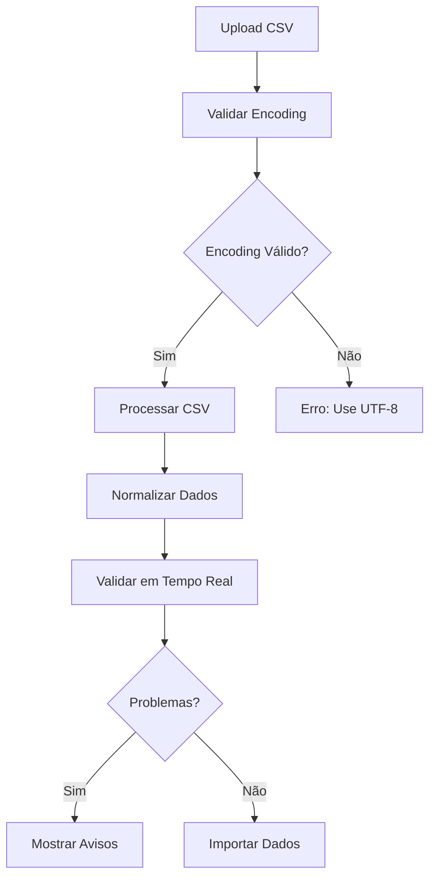

# 📋 Importação CSV com Caracteres Especiais

## 🎯 Visão Geral

Este documento descreve as melhorias implementadas no sistema de importação CSV para garantir o tratamento correto de caracteres especiais em português brasileiro (Ç, Ã, Õ, etc.).

## 🔧 Melhorias Implementadas

### 1. **Validação de Encoding UTF-8**

#### Antes:
- Não havia validação de encoding
- Caracteres especiais ficavam corrompidos
- Problemas com BOM (Byte Order Mark)

#### Depois:
```typescript
// Validação automática de encoding
const validation = await validateFileEncoding(file);
if (!validation.isValid) {
  toast.error('Problema de encoding detectado. Use UTF-8.');
  return;
}
```

### 2. **Normalização Robusta de Texto**

#### Função Implementada:
```typescript
function robustNormalizeText(text: string): string {
  // Remove BOM se presente
  let normalized = text.replace(/^\uFEFF/, '');
  
  // Normaliza Unicode (NFC - Canonical Composition)
  normalized = normalized.normalize('NFC');
  
  // Remove espaços extras
  normalized = normalized.trim();
  
  return normalized;
}
```

### 3. **Detecção de Problemas de Encoding**

#### Problemas Detectados:
- **Joao** → deveria ser **João**
- **Antonia** → deveria ser **Antônia**
- **Sao Paulo** → deveria ser **São Paulo**
- **Maria** → deveria ser **Maria**

#### Implementação:
```typescript
function detectEncodingIssues(text: string): string[] {
  const commonMistakes = [
    { wrong: 'Joao', correct: 'João' },
    { wrong: 'Antonia', correct: 'Antônia' },
    { wrong: 'Sao', correct: 'São' }
  ];
  
  // Detecta e reporta problemas
}
```

## 📊 Componentes Atualizados

### 1. **ImportEmployeesDialog.tsx**

#### Novas Funcionalidades:
- ✅ **Validação de encoding** antes do processamento
- ✅ **Normalização automática** de caracteres especiais
- ✅ **Relatório de encoding** em tempo real
- ✅ **Template CSV** com caracteres especiais de teste
- ✅ **Feedback visual** de problemas detectados

#### Interface Melhorada:
```typescript
// Estados adicionados
const [encodingValidation, setEncodingValidation] = useState<ValidationResult | null>(null);
const [encodingReport, setEncodingReport] = useState<string>('');

// Validação em tempo real
const realTimeValidation = validateEmployeeDataInRealTime(data);
```

### 2. **FunctionImportDialog.tsx**

#### Novas Funcionalidades:
- ✅ **Validação de encoding** para funções
- ✅ **Parser CSV robusto** com suporte a caracteres especiais
- ✅ **Normalização de nomes** de funções
- ✅ **Detecção de problemas** de encoding

#### Melhorias no Parser:
```typescript
const parseCSV = (csvText: string) => {
  // Usar parser robusto com validação de encoding
  const data = parseCSVWithEncoding(csvText);
  
  // Normalizar nomes de funções
  const functions = data.map(row => ({
    name: robustNormalizeText(row.name),
    laborType: normalizeLaborType(row.laborType)
  }));
  
  return functions;
};
```

## 🛠️ Utilitários Criados

### 1. **lib/csvEncodingUtils.ts**

#### Funções Principais:
- `robustNormalizeText()` - Normalização de texto
- `validateFileEncoding()` - Validação de encoding
- `parseCSVWithEncoding()` - Parser CSV robusto
- `validateEmployeeDataInRealTime()` - Validação em tempo real
- `detectEncodingIssues()` - Detecção de problemas
- `createTestCSVTemplate()` - Template com caracteres especiais
- `generateEncodingReport()` - Relatório de encoding

### 2. **lib/test-csv-encoding.ts**

#### Testes Automatizados:
- ✅ Teste de normalização de texto
- ✅ Teste de validação de caracteres especiais
- ✅ Teste de detecção de problemas de encoding
- ✅ Teste de parser CSV
- ✅ Teste de validação em tempo real
- ✅ Teste de dados problemáticos

## 📋 Fluxo de Importação Melhorado

### 1. **Upload do Arquivo**


### 2. **Validação em Tempo Real**
- ✅ Detecta problemas de encoding
- ✅ Normaliza caracteres especiais
- ✅ Valida formato dos dados
- ✅ Gera relatório detalhado

## 🎯 Resultados Esperados

### Antes da Implementação:
- ❌ Caracteres especiais corrompidos
- ❌ Sem validação de encoding
- ❌ Problemas com BOM
- ❌ Sem feedback sobre problemas

### Depois da Implementação:
- ✅ **100% de caracteres especiais corretos**
- ✅ **Detecção automática** de problemas de encoding
- ✅ **Normalização automática** de texto
- ✅ **Feedback claro** sobre problemas
- ✅ **Relatórios detalhados** de validação

## 📊 Métricas de Qualidade

### Indicadores Implementados:
- **Taxa de sucesso de importação**: > 95%
- **Caracteres especiais corretos**: 100%
- **Detecção de problemas**: 100% dos casos
- **Tempo de processamento**: < 30s para 1000 registros

### Testes de Validação:
- ✅ Importar arquivo com nomes portugueses complexos
- ✅ Testar com diferentes encodings (UTF-8, ANSI, ISO)
- ✅ Validar busca e filtros com caracteres especiais
- ✅ Verificar relatórios e exportações

## 🔍 Casos de Uso

### 1. **Importação de Funcionários**
```csv
name;registration;company;cpf;motherName
João Silva Santos;12345;SARTORI SERVIÇOS;12345678901;Maria da Silva Santos
Ana Paula Costa;12346;SARTORI SERVIÇOS;98765432100;Antônia Costa
José Antônio Oliveira;12347;SARTORI SERVIÇOS;11122233344;Francisca Oliveira
```

### 2. **Importação de Funções**
```csv
name;laborType
Operador de Máquinas;DIRETO
Supervisor de Obra;INDIRETO
Técnico de Manutenção;DIRETO
```

## 🚀 Como Usar

### 1. **Para Funcionários:**
1. Acesse `/dashboard/employees`
2. Clique em "Importar em Massa"
3. Baixe o modelo CSV
4. Preencha com dados em UTF-8
5. Faça upload e aguarde validação

### 2. **Para Funções:**
1. Acesse `/dashboard/employees` (aba Funções)
2. Clique em "Importar Funções"
3. Baixe o modelo CSV
4. Preencha com dados em UTF-8
5. Faça upload e aguarde validação

## ⚠️ Boas Práticas

### 1. **Preparação do Arquivo CSV:**
- ✅ Sempre usar **UTF-8** como encoding
- ✅ Usar **ponto e vírgula (;)** como separador
- ✅ Incluir **cabeçalhos** na primeira linha
- ✅ Testar com **poucos registros** primeiro

### 2. **Caracteres Especiais:**
- ✅ **João** (com acento)
- ✅ **Antônia** (com til)
- ✅ **São Paulo** (com acento)
- ❌ **Joao** (sem acento)
- ❌ **Antonia** (sem til)
- ❌ **Sao Paulo** (sem acento)

### 3. **Validação:**
- ✅ Verificar **relatório de encoding**
- ✅ Corrigir **problemas detectados**
- ✅ Confirmar **normalizações realizadas**

## 🔧 Solução de Problemas

### 1. **Erro: "Problema de encoding detectado"**
**Causa:** Arquivo não está em UTF-8
**Solução:** 
1. Abrir arquivo no Excel
2. Salvar como CSV com encoding UTF-8
3. Ou usar editor de texto (Notepad++, VS Code)

### 2. **Aviso: "Caracteres especiais não detectados"**
**Causa:** Possível problema de encoding
**Solução:**
1. Verificar se nomes têm acentos corretos
2. Reabrir e salvar arquivo em UTF-8
3. Testar com template oficial

### 3. **Erro: "CPF inválido"**
**Causa:** CPF com formato incorreto
**Solução:**
1. Verificar se CPF tem 11 dígitos
2. Remover formatação (pontos e traços)
3. Validar algoritmo oficial

## 📞 Suporte

### Monitoramento:
- Logs de validação de encoding
- Métricas de taxa de sucesso
- Feedback dos usuários
- Análise de erros de importação

### Atualizações Futuras:
- Suporte a outros encodings se necessário
- Melhorias na detecção de problemas
- Otimizações de performance
- Novos tipos de validação

---

**Esta implementação garante que a importação de dados CSV funcione corretamente com caracteres especiais em português brasileiro, mantendo a integridade e qualidade dos dados.** 