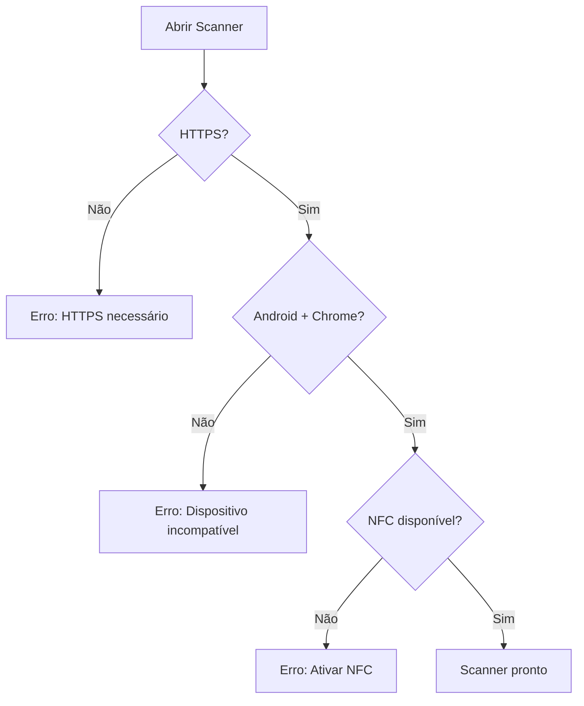
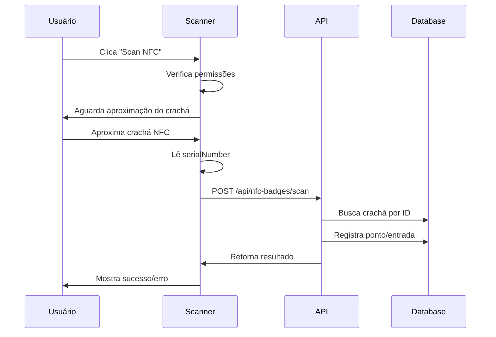

# Configuração Scanner NFC

## 📱 Requisitos para Android

### Pré-requisitos
- ✅ **Android 7.0+** (API 24+)
- ✅ **Chrome 89+** 
- ✅ **HTTPS** (conexão segura)
- ✅ **NFC habilitado** no dispositivo

### Configuração do Dispositivo

#### 1. Ativar NFC no Android
```
Configurações > Conexões > NFC e pagamento > NFC = ATIVADO
```

#### 2. Verificar Permissões do Chrome
```
Chrome > Configurações > Configurações do site > NFC = PERMITIR
```

#### 3. Configurar HTTPS
O scanner NFC **só funciona** com conexão HTTPS segura:
- ✅ `https://localhost:3001` (desenvolvimento)
- ✅ `https://seudominio.com` (produção)
- ❌ `http://localhost:3001` (não funciona)

## 🔧 Implementação

### Componente Scanner
```tsx
import NFCScanner from '@/components/nfc-badges/NFCScanner';

function MyComponent() {
  const [isScannerOpen, setIsScannerOpen] = useState(false);

  const handleBadgeDetected = (badgeId: string) => {
    console.log('Crachá detectado:', badgeId);
  };

  return (
    <>
      <Button onClick={() => setIsScannerOpen(true)}>
        Scan NFC
      </Button>
      
      <NFCScanner
        isOpen={isScannerOpen}
        onClose={() => setIsScannerOpen(false)}
        onBadgeDetected={handleBadgeDetected}
      />
    </>
  );
}
```

### Botão Simplificado
```tsx
import NFCScanButton from '@/components/nfc-badges/NFCScanButton';

// Uso direto
<NFCScanButton />
```

## 🛠️ API Web NFC

### Verificação de Suporte
```javascript
// Verificar se NFC está disponível
const isSupported = 'NDEFReader' in window && 
                   window.isSecureContext && 
                   /Android/.test(navigator.userAgent) && 
                   /Chrome/.test(navigator.userAgent);
```

### Leitura de Crachás
```javascript
const ndef = new NDEFReader();

ndef.addEventListener('reading', (event) => {
  const badgeId = event.serialNumber;
  console.log('ID do crachá:', badgeId);
});

await ndef.scan();
```

## 📋 Fluxo de Uso

### 1. Verificação Inicial


### 2. Processo de Escaneamento


## ⚠️ Limitações e Soluções

### Limitações Conhecidas
- **Apenas Android**: iOS não suporta Web NFC API
- **Apenas Chrome**: Firefox/Safari não implementaram
- **Apenas HTTPS**: Segurança obrigatória
- **Timeout**: 30 segundos para detectar crachá

### Fallbacks
```tsx
// Verificação de compatibilidade
const NFCCompatibility = {
  check() {
    if (!window.isSecureContext) {
      return { supported: false, reason: 'HTTPS necessário' };
    }
    
    if (!/Android/.test(navigator.userAgent)) {
      return { supported: false, reason: 'Funciona apenas no Android' };
    }
    
    if (!/Chrome/.test(navigator.userAgent)) {
      return { supported: false, reason: 'Use o navegador Chrome' };
    }
    
    if (!('NDEFReader' in window)) {
      return { supported: false, reason: 'Web NFC API não disponível' };
    }
    
    return { supported: true };
  }
};
```

## 🔍 Debugging

### Console do Chrome
```javascript
// Verificar disponibilidade
console.log('Secure context:', window.isSecureContext);
console.log('NDEFReader:', 'NDEFReader' in window);
console.log('User agent:', navigator.userAgent);

// Testar permissões
navigator.permissions.query({ name: 'nfc' })
  .then(result => console.log('NFC permission:', result.state));
```

### Logs de Erro Comuns
```
NotAllowedError: Usuário negou permissão NFC
NotSupportedError: NFC não suportado no dispositivo  
NotReadableError: NFC não está disponível
SecurityError: Página não é HTTPS
```

## 📱 Teste em Produção

### Setup HTTPS Local
```bash
# Gerar certificado local
npx create-next-app@latest --typescript
npm install -g mkcert
mkcert -install
mkcert localhost

# Next.js com HTTPS
npm run dev -- --experimental-https
```

### Deploy com HTTPS
```yaml
# Vercel (automático)
vercel deploy

# Netlify (automático) 
netlify deploy

# Manual com certificado
server {
  listen 443 ssl;
  ssl_certificate /path/to/cert.pem;
  ssl_certificate_key /path/to/key.pem;
}
```

## 🎯 Próximos Passos

1. **Testar** em dispositivo Android real
2. **Configurar** HTTPS em desenvolvimento
3. **Implementar** fallback para dispositivos incompatíveis
4. **Adicionar** logs detalhados para debugging
5. **Criar** interface para cadastro manual como alternativa 