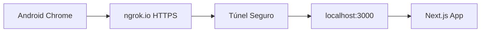

# Scanner NFC - Setup Windows

## 🚀 Solução Rápida com ngrok

### Por que ngrok?
- ✅ **HTTPS automático** sem configurar certificados
- ✅ **Funciona no Windows** sem OpenSSL
- ✅ **URL pública** acessível de qualquer dispositivo
- ✅ **Zero configuração** - funciona imediatamente

### Setup em 2 Passos

#### 1. Iniciar Túnel HTTPS
```bash
npm run nfc:tunnel
```

#### 2. Usar no Android
1. **Aguarde** o ngrok mostrar a URL (ex: `https://abc123.ngrok.io`)
2. **Copie** a URL HTTPS
3. **Abra Chrome** no Android
4. **Acesse** `https://abc123.ngrok.io/dashboard/nfc-management`
5. **Ative NFC** no Android
6. **Clique** em "Scan NFC"

## 📱 Instruções Detalhadas

### Configuração Android
```
Configurações > Conexões > NFC = ATIVADO
Chrome > Configurações > Permissões > NFC = PERMITIR
```

### Teste do Scanner
1. **Abrir** página de gestão de crachás
2. **Clicar** no botão "Scan NFC"
3. **Verificar** se mostra "NFC Disponível"
4. **Aproximar** crachá da parte traseira do celular
5. **Aguardar** detecção automática

## 🔧 Comandos Disponíveis

### Desenvolvimento Normal
```bash
npm run dev                 # HTTP local (porta 3000)
```

### Para Testar NFC
```bash
npm run nfc:tunnel         # Túnel HTTPS automático
npm run nfc:ngrok          # Apenas ngrok (manual)
```

## 🌐 Como Funciona o ngrok

### Fluxo de Conexão


### Vantagens
- ✅ HTTPS real com certificado válido
- ✅ Acessível de qualquer lugar
- ✅ Não precisa configurar rede
- ✅ Funciona com firewall corporativo

## ⚠️ Limitações do ngrok (Gratuito)

- 🕐 **Sessão temporária** (URL muda a cada reinicialização)
- 🌐 **Velocidade limitada** (suficiente para desenvolvimento)
- 👥 **Uso público** (não usar dados sensíveis)

## 🔍 Troubleshooting

### Problema: "NFC Indisponível"
**Causa:** Não está usando HTTPS
**Solução:** Usar ngrok (`npm run nfc:tunnel`)

### Problema: "Permissão NFC negada"
**Causa:** Chrome não tem permissão
**Solução:** 
```
Chrome > Configurações > Configurações do site > NFC > Permitir
```

### Problema: "Timeout no scan"
**Causa:** Crachá não detectado
**Solução:**
- Verificar se NFC está ativo no Android
- Aproximar mais o crachá
- Tentar diferentes posições na parte traseira

### Problema: ngrok não inicia
**Causa:** Porta 3000 ocupada
**Solução:**
```bash
# Parar processos na porta 3000
npx kill-port 3000
npm run nfc:tunnel
```

## 📋 Checklist de Teste

### Antes de Testar
- [ ] Android com NFC ativo
- [ ] Chrome instalado e atualizado
- [ ] Conexão com internet
- [ ] Crachá NFC disponível

### Durante o Teste
- [ ] `npm run nfc:tunnel` executado
- [ ] URL ngrok copiada
- [ ] Página carregada no Chrome Android
- [ ] Scanner mostra "NFC Disponível"
- [ ] Crachá aproximado da parte traseira

### Resultado Esperado
- [ ] Detecção automática do crachá
- [ ] ID do crachá exibido
- [ ] Processamento na API
- [ ] Notificação de sucesso/erro

## 🎯 Alternativas Avançadas

### Para Produção
```bash
# Deploy com HTTPS automático
vercel deploy
netlify deploy
```

### Para Desenvolvimento Local
```bash
# Instalar OpenSSL no Windows
# https://slproweb.com/products/Win32OpenSSL.html
openssl genrsa -out key.pem 2048
openssl req -new -x509 -key key.pem -out cert.pem -days 365
```

### Para Rede Local
```bash
# Descobrir IP local
ipconfig | findstr IPv4

# Configurar certificado para IP
# (Requer configuração manual)
```

## 📞 Suporte

### Links Úteis
- [Web NFC API](https://developer.mozilla.org/en-US/docs/Web/API/Web_NFC_API)
- [ngrok Documentation](https://ngrok.com/docs)
- [Chrome NFC Support](https://web.dev/nfc/)

### Logs de Debug
```javascript
// Console do Chrome
console.log('Secure context:', window.isSecureContext);
console.log('NDEFReader:', 'NDEFReader' in window);
console.log('User agent:', navigator.userAgent);
``` 